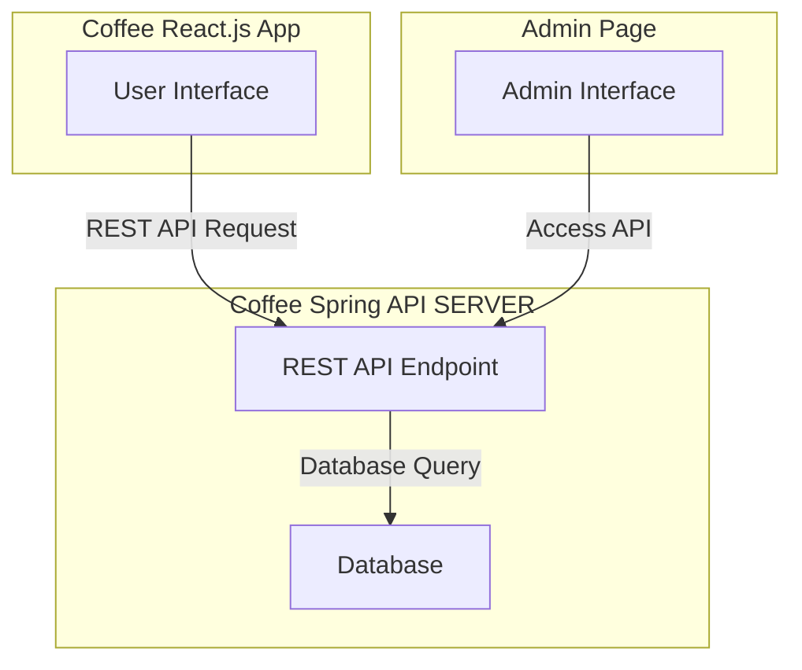

# 1차 프로젝트

## 프로젝트 구성도

## 프론트
### 메인페이지
백엔드 API를 활용해 등록된 모든 상품을 조회, 해당 데이터를 바탕으로 화면에 상품을 표시

게시된 상품을 클릭하여 상품 정보 페이지로 이동

장바구니 버튼을 눌러 장바구니 페이지로 이동
### 상품 정보 페이지
이동된 상품의 세부 정보 제품명, 가격, 이미지 등을 표시

갯수를 선택하여 장바구니에 담을 수 있음

장바구니에 상품을 담을 시 팝업창을 통해 장바구니로 바로 이동하거나 현재 페이지에 머무를 수 있음.
### 장바구니
지금까지 담은 상품의 항목과 개수를 표시해주며 각 소계와 총계를 화면에 표시

주문자(email)과 배송지, 우편번호를 입력받아 결제페이지로 이동

### 결제 페이지(새 페이지 혹은 경고창으로 처리)
시연을 위한 페이지로 실제 결제를 구현하진 않고 결제 성공, 실패를 임의로 선택해서 전송

                결제 하시겠습니까.
                [결제 완료하기], [결제 취소하기]

버튼 눌러서 결제 결과 페이지로 이동하기

### 결제 결과 페이지
결제가 완료되면 생성된 주문정보 (주문id, 주문항목 및 개수, 결제 금액)를 화면에 표시

메인페이지로 이동하기 버튼을 제시

### 관리자 페이지
상품 등록, 수정, 삭제 기능 [폼으로 처리]

접수된 모든 주문 및 배송 정보를 표시, 필터링, 관리

## 백엔드

### API
| **API 이름**     | **메서드**  | **URL**        | **설명**               |
|----------------|----------|----------------|----------------------|
| **주문 생성**      | `POST`   | `/orders`      | 새로운 주문을 생성합니다.       |
| **주문 조회 (단건)** | `GET`    | `/orders/{id}` | 특정 주문의 상세 정보를 조회합니다. |
| **주문 전체 조회**   | `GET`    | `/orders`      | 모든 주문을 조회합니다.        |
| **주문 수정**      | `PUT`    | `/orders/{id}` | 특정 주문을 수정합니다.        |
| **주문 삭제**      | `DELETE` | `/orders/{id}` | 특정 주문을 삭제합니다.        |
| **주문 결제 완료**   | `POST`   | `/orders/{id}/payment/complete` | 특정 주문의 결제를 완료 처리합니다. |
| **주문 결제 취소**   | `POST`   | `/orders/{id}/payment/cancel` | 특정 주문의 결제를 취소 처리합니다. |
--- 
| **API 이름**         | **메서드** | **URL**                  | **설명**                    |
|--------------------|------------|--------------------------|---------------------------|
| **상품 생성**       | `POST`      | `/products`              | 새로운 커피상품을 등록합니다. |
| **상품 목록 조회**       | `GET`      | `/products`              | 현재 판매 중인 커피 상품 목록을 조회합니다. |
| **상품 세부 정보 조회**    | `GET`      | `/products/{id}`         | 특정 커피 상품의 세부 정보를 조회합니다.   |
| **상품 정보 수정**    | `PUT`      | `/products/{id}`         | 특정 커피 상품의 정보를 수정합니다.   |
| **상품 삭제**    | `DELETE`      | `/products/{id}`         | 특정 커피 상품을 삭제합니다.   |
--- 
| **API 이름**         | **메서드** | **URL**                  | **설명**                    |
|--------------------|------------|--------------------------|---------------------------|
| **배송 정보 전체 조회**    | `GET`      | `/delevery`         | 모든 배송 정보를 조회합니다.   view파라미터를 통해 완료된 배송정보를 포함할 지 정합니다  ex) all(완료 포함 모두), done(완료된 건만 조회), today(오늘 발송되어야하는 목록), none(기본값, 미완료건만 조회). |
| **배송 정보**    | `GET`      | `/delevery/{id}`         | 특정 배송 정보를 조회합니다.   |
| **배송 정보**    | `PUT`      | `/delevery/{id}`         | 특정 배송 정보를 수정합니다.   |

## ERD
# 엔티티

## 1. 상품 (Product)
가게 웹페이지에서 구매가능하도록 등록된 상품을 담을 엔티티

상품명, 상세설명, 가격등을 포함한다.

| 속성명             | 데이터 타입        | 설명            |
|-----------------|---------------|---------------|
| **product_id**  | Int           | 상품 고유 식별자     |
| **name**        | String        | 상품명           |
| **description** | String        | 상품 상세 설명      |
| **price**       | Int       | 상품 가격         |
| **created_at**  | LocalDateTime | 상품 등록일        |
| **updated_at**  | LocalDateTime | 상품 정보 마지막 수정일 |

## 2. 주문 (Order)
사용자가 화면을 통해 주문한 주문 정보를 담을 엔티티

주문자(이메일), 배송주소, 주문한 물건의 총 결제 금액, 결제 완료여부 등을 포함한다.

| 속성명               | 데이터 타입        | 설명                       |
|-------------------|---------------|--------------------------|
| order_id          | Int          | 고객 주문 고유 식별자 (한 번의 결제)   |
| customer_email    | String        | 주문자 이메일 주소               |
| shipping_address  | String        | 이 주문의 배송 주소              |
| shipping_zip-code | String        | 이 주문의 우편번호               |
| total_amount      | Int    | 이 주문의 총 결제 금액            |
| status            | String        | 주문 상태 (예: "결제 완료", "취소") |
| **created_at**    | LocalDateTime | 주문이 접수된 실제 시간            |
| **updated_at**    | LocalDateTime | 주문 정보 마지막 수정일            |

## 3. 주문 항목 (OrderItem)

사용자가 주문한 product 정보를 담을 엔티티

주문 id, 주문된 상품의 id, 해당 상품의 수량, 가격, 소계등을 포함한다.

| 속성명             | 데이터 타입        | 설명                    |
|-----------------|---------------|-----------------------|
| order_item_id   | Int          | 주문 항목 고유 식별자          |
| order_id        | Int          | 이 항목이 속한 고객 주문 ID     |
| product_id      | Int          | 주문된 상품 ID             |
| quantity        | Int       | 주문된 상품 수량             |
| price_per_item  | Int    | 주문 시점의 개별 상품 가격       |
| subtotal_amount | Int    | 이 항목의 소계 (상품 가격 * 수량) |
| **created_at**  | LocalDateTime | 주문이 접수된 실제 시간         |
| **updated_at**  | LocalDateTime | 주문 정보 마지막 수정일         |

## 4. 배송 (Delivery)

일괄 처리될 때 한 번에 배송처리되는 배송 정보를 담을 엔티티

배송 id, 주문자 email, 배송지, 총계, 배송상태 등을 포함

배송정보와 주문 1대다 관계

| 속성명                   | 데이터 타입 (Java) | 설명                                |
|-----------------------|---------------|-----------------------------------|
| delivery_id           | Int           | 배송 묶음 고유 식별자                      |
| customer_email        | String        | 이 배송 묶음의 주문자 이메일                  |
| shipping_address      | String        | 이 배송 묶음의 공통 배송 주소                 |
| orders                 | List\<Order>| 배송에 포함된 모든 주문들                    |
| total_delivery_amount | Int           | 이 배송 묶음 내 모든 주문의 총합 금액            |
| status                | String        | 배송 묶음의 상태 (예: "배송 준비 중", "배송 완료") |
| **created_at**        | LocalDateTime |                                   |
| **updated_at**        | LocalDateTime |                                   |

## 5. 파일(이후에 추가 가능)

