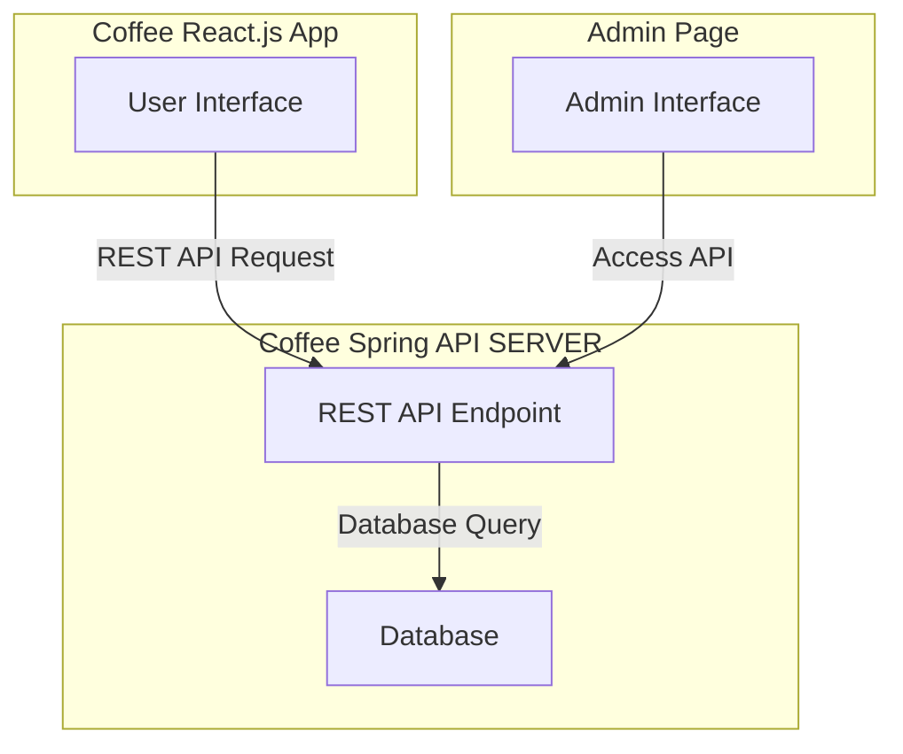

# 1차 프로젝트

## 프로젝트 구성도

## 프론트

기술 : Next.js, React.js, TypeScript, Tailwind CSS

## 백엔드

기술 : Spring Boot, JPA, MySQL
### API
| **API 이름**         | **메서드** | **URL**                  | **설명**                    |
|--------------------|------------|--------------------------|---------------------------|
| **주문 생성**          | `POST`     | `/orders`                | 새로운 주문을 생성합니다.            |
| **주문 조회 (단건)**     | `GET`      | `/orders/{id}`           | 특정 주문의 상세 정보를 조회합니다.      |
| **주문 전체 조회**       | `GET`      | `/orders`                | 모든 주문을 조회합니다.             |
| **주문 수정**          | `PUT`      | `/orders/{id}`           | 특정 주문을 수정합니다.             |
| **주문 삭제**          | `DELETE`   | `/orders/{id}`           | 특정 주문을 삭제합니다.             |
| **오늘 배송 대상 주문 조회** | `GET`      | `/orders/delivery-today` | 오늘 배송 대상 주문을 조회합니다.       |
| **상품 생성**       | `POST`      | `/products`              | 새로운 커피상품을 등록합니다. |
| **상품 목록 조회**       | `GET`      | `/products`              | 현재 판매 중인 커피 상품 목록을 조회합니다. |
| **상품 세부 정보 조회**    | `GET`      | `/products/{id}`         | 특정 커피 상품의 세부 정보를 조회합니다.   |

## ERD
